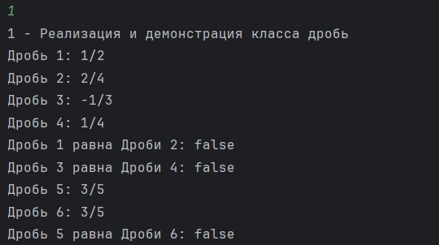
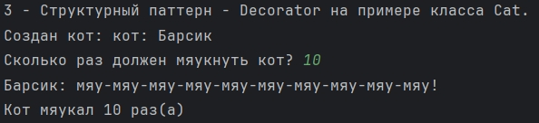
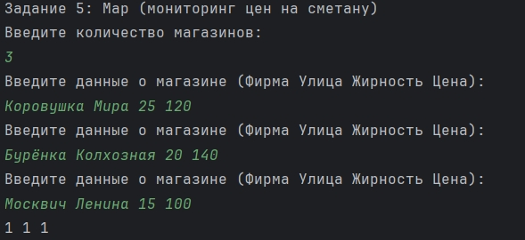
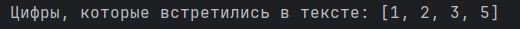
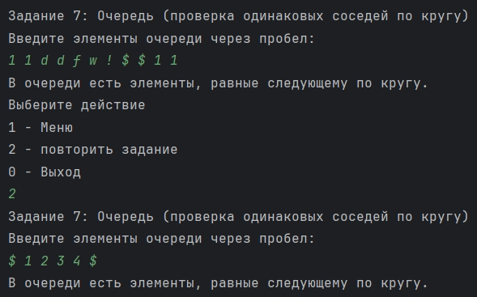
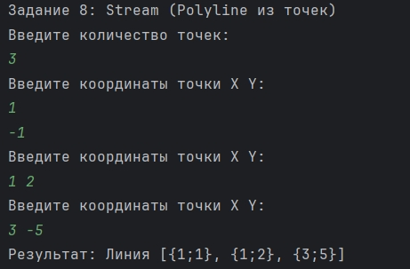
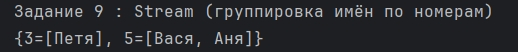

Лабораторная Работа 5

Задание №1

В класс Дробь, добавить интерфейс на два метода: получение вещественного значения, установка
числителя и установка знаменателя.
Сгенерировать такую версию дроби, которая будет кэшировать вычисление вещественного
значения.
Если раннее в вашем варианте не было Дроби, то создайте сущность Дробь со следующими
особенностями:

• Имеет числитель: целое число

• Имеет знаменатель: целое число

• Дробь может быть создана с указанием числителя и знаменателя

• Может вернуть строковое представление вида “числитель/знаменатель”

• Необходимо корректно обрабатывать отрицательные значения. Учтите, что знаменатель не может
быть отрицательным.

• Переопределите метод сравнения объектов по состоянию таким образом, чтобы две дроби
считались одинаковыми тогда, когда у них одинаковые значения числителя и знаменателя.

В ходе выполнения данного задания был создан интерфейс FractionOperations, класс CachedFraction, класс Fraction

класс Fraction:

Представляющий простую дробь и реализующий интерфейс FractionOperations.

Он обеспечивает:

хранение числителя и знаменателя (с проверкой, что знаменатель не равен нулю);

корректировку знака знаменателя (отрицательный знаменатель преобразуется в положительный);

доступ к значениям числителя и знаменателя через методы getNumerator() и getDenominator();

вычисление десятичного значения дроби методом getDecimalValue();

строковое представление вида "числитель/знаменатель" через toString().

Таким образом, класс инкапсулирует логику работы с дробями, обеспечивая безопасное хранение и удобное представление.

класс CachedFraction:

Реализующий паттерн Decorator для работы с дробями.

Он оборачивает объект, реализующий интерфейс FractionOperations, и добавляет:

кеширование результата метода getDecimalValue() — повторные вызовы возвращают сохранённое значение без повторных вычислений;

вывод сообщений о том, берётся ли значение из кэша или вычисляется заново;

метод clearCache() для очистки сохранённого результата;

делегирование метода toString() исходному объекту.

Таким образом, CachedFraction расширяет функциональность дробей, добавляя механизм кеширования вычислений без изменения исходной логики класса.

Задание №2

Необходимо воспользоваться классом Кот и методом принимающим всех мяукающих из задачи 2.5.4.
Необходимо таким образом передать кота в указанный метод, что бы после окончания его работы
узнать сколько раз мяукал кот за время его работы. На рисунке показан пример работы. Перед вызовом
метода создаем кота, отправляем ссылку на кота в метод, после окончания его работы выводим
количество мяуканий на экран. Кота изменять нельзя.
Если раннее в вашем варианте не было Кота, то создайте

2. интерфейс Мяуканье: разработайте метод, который принимает набор объектов способных
мяукать и вызывает мяуканье у каждого объекта. Мяукающие объекты должны иметь метод со
следующей сигнатурой:

В ходе выполнения данного задания был создан интерфейс Meowable, класс Cat, класс CoutingCat

класс Cat:

Реализующий интерфейс Meowable и моделирующий поведение кота.

Он предоставляет:

хранение имени кота (name);

метод meow() для простого «мяу»;

перегруженный метод meow(int n) для многократного «мяу» с разделителем -;

обработку некорректных значений (n <= 0 → вывод «...»);

строковое представление в формате "кот: имя".

Таким образом, класс инкапсулирует базовое поведение кота, позволяя гибко управлять количеством «мяу» и выводить его имя.

CoutingCat:

Реализующий структурный паттерн Decorator для расширения поведения кота.

Он оборачивает объект Cat и добавляет:

учёт количества вызовов метода meow() и meow(int n);

метод getMeowCount() для получения общего числа «мяу»;

метод resetMeowCount() для сброса счётчика;

доступ к оригинальному коту через getCat();

делегирование строкового представления (toString()) исходному объекту.

Таким образом, CountingCat дополняет функциональность кота возможностью вести статистику его «мяуканий», сохраняя при этом исходное поведение.

Задание №3

Составить программу, которая в списке L из каждой группы подряд идущих одинаковых
элементов оставляет только один

В ходе выполнения данного задания был создан класс ListProcessor

класс ListProcessor:

Утилитный класс для работы со списками.

Он содержит метод:

compress(List<T> input) — принимает список и возвращает новый, в котором подряд идущие одинаковые элементы сведены к одному.

Таким образом, класс демонстрирует простую обработку коллекций, устраняя дубликаты последовательных значений и сохраняя порядок элементов.

Задание №4

В молочных магазинах города Х продается сметана с жирностью 15, 20 и 25 процентов. В городе
X был проведен мониторинг цен на сметану. Напишите эффективную по времени работы и по
используемой памяти программу, которая будет определять для каждого вида сметаны, сколько
магазинов продают ее дешевле всего. На вход программе сначала подается число магазинов N. В
каждой из следующих N строк находится информация в следующем формате:

<Фирма><Улица><Жирность><Цена>

где <Фирма> – строка, состоящая не более, чем из 20 символов без пробелов, <Улица> – строка,
состоящая не более, чем из 20 символов без пробелов, <Жирность> – одно из чисел – 15, 20 или
25, <Цена> – целое число в диапазоне от 2000 до 5000, обозначающее стоимость одного литра
сметаны в копейках. <Фирма> и <Улица>,<Улица> и <Жирность>, а также <Жирность> и <Цена>
разделены ровно одним пробелом. Пример входной строки:

Перекресток Короленко 25 120

Программа должна выводить через пробел 3 числа – количество магазинов, продающих дешевле
всего сметану с жирностью 15, 20 и 25 процентов. Если какой-то вид сметаны нигде не
продавался, то следует вывести 0.

В ходе выполнения данного задания был создан класс SmetanaMonitor

класс SmetanaMonitor:

Утилитный класс для анализа цен на сметану в магазинах.

Он реализует метод:

analyze(List<String> input) — принимает список строк с данными о магазинах и определяет:

минимальную цену для каждой жирности (15%, 20%, 25%),

количество магазинов, продающих по этой минимальной цене.

Результат возвращается в виде массива из трёх чисел:

[кол-во для 15%, кол-во для 20%, кол-во для 25%].

Таким образом, класс демонстрирует поиск минимальных цен и подсчёт магазинов‑лидеров по каждой категории жирности.

Задание №5

Файл содержит текст на русском языке. Какие цифры встречаются в тексте?

В ходе выполнения данного задания был создан класс DigitFinder

класс DigitFinder:

Утилитный класс для работы с текстовыми файлами и поиска цифр.

Он реализует:

приватный метод createFile() — создаёт файл a.txt с тестовым текстом, содержащим числа;

публичный метод findDigits() — читает файл и возвращает множество уникальных цифр, встречающихся в тексте.

Таким образом, класс демонстрирует автоматическое создание файла и извлечение всех цифр из его содержимого.

Задание №6

Определить, есть ли в очереди L хотя бы один элемент, который равен следующему за ним (по
кругу) элементу (первый элемент считать следующим для последнего).

В ходе выполнения данного задания был создан класс QueueChecker

класс QueueChecker:

Утилитный класс для анализа очередей.

Он реализует метод:

hasEqualNext(Queue<T> queue) — проверяет, есть ли в очереди элемент, равный следующему за ним (с учётом циклического перехода от последнего к первому).

Таким образом, класс демонстрирует поиск повторяющихся соседних элементов в структуре очереди, сохраняя удобство работы за счёт преобразования её в список.

Задание 7.1
Необходимо написать стрим:
Дан набор объектов типа Point, необходимо взять все Point в разных координатах, убрать с
одинаковыми X,Y, отсортировать по X, отрицательные Y сделать положительными и собрать это
все в ломаную (объект типа Polyline)
Если раннее в вашем варианте не было задание с классом Point и Polyline, то написать их:

1. класс Point:
• Координата Х: число.
• Координата Y: число.
• Может возвращать текстовое представление вида “{X;Y}”.

3. класс Line (Линия), расположенная на двумерной плоскости, которая описывается:
• Координата начала: Точка
• Координата конца: Точка
• Может возвращать текстовое представление вида “Линия от {X1;Y1} до {X2;Y2}”

5. класс Polyline (Ломаная), которая будет представлять собой ломаную линию. Ломаная
линия представляет собой набор следующих характеристик:

• Имеет массив Точек, через которые линия проходит.
• Может быть приведена к строковой форме вида “Линия [Т1,T2,…,TN]”, где TN – это
результат приведения к строке Точки с номером N

В ходе выполнения данного задания был создан класс Point, класс Line, класс Polyline, класс StreamExample

класс Point: 

Для представления точки на плоскости с координатами x и y.

Он предоставляет:

хранение координат точки;

методы доступа getX() и getY();

метод normalizeY() — преобразует отрицательное значение y в положительное;

строковое представление в формате "{x;y}";

корректные реализации equals() и hashCode() для сравнения и использования в коллекциях.

Таким образом, класс инкапсулирует базовую модель точки, обеспечивая удобное сравнение, вывод и нормализацию координат.

класс Line:

Для представления линии на плоскости.

Он хранит:

начальную точку (start),

конечную точку (end).

Метод toString() возвращает строковое описание в формате: «Линия от {x;y} до {x;y}», где координаты берутся из объектов Point.

Таким образом, класс инкапсулирует базовую модель линии, связывая две точки и предоставляя удобное текстовое представление.

класс Polyline:

Для представления ломаной линии на плоскости.

Он хранит:

список точек (points), которые образуют последовательность сегментов линии.

Метод toString() возвращает строковое описание в формате: «Линия [точки]», где каждая точка выводится в своём представлении ({x;y}).

Таким образом, класс инкапсулирует модель ломаной линии, позволяя хранить и отображать набор связанных точек.

класс StreamExample:

Утилитный класс, демонстрирующий использование Java Stream API для обработки коллекций.

Он реализует метод:

buildPolyline(List<Point> input) — принимает список точек и выполняет последовательные операции:

нормализация координаты y (отрицательные значения становятся положительными),

удаление дубликатов (distinct()),

сортировка по координате x,

сбор результата в список.

Возвращается объект Polyline, построенный из обработанных точек.

Таким образом, класс показывает практическое применение Stream API для преобразования и фильтрации данных, формируя ломаную линию из уникальных и отсортированных точек.

Задание 7.2

Дан текстовый файл со строками, содержащими имя человека и его номер в следующей форме:

Вася:5

Петя:3

Аня:5

Номера людей могут повторяться. У каких-то людей может не быть номера.
Необходимо написать стрим выполняющую следующее:
читаются все люди из файла, все имена приводится к нижнему регистру, но с первой буквой в
верхнем регистре, убираем из перечня всех людей без номеров, а имена оставшихся группируются
по их номеру:

[5:[Вася, Аня], 3:[Петя]]

В ходе выполнения данного задания был создан класс PeopleStream

класс PeopleStream:

Утилитный класс, демонстрирующий работу с файлами и использование Java Stream API для обработки данных.

Он реализует:

приватный метод createFile() — создаёт файл name.txt с примерами строк формата "Имя:номер" и строкой без номера;

публичный метод process() — читает файл и выполняет обработку через стрим:

фильтрует строки, оставляя только те, где указан номер,

нормализует имена (нижний регистр + первая буква заглавная),

преобразует данные в пары (номер, имя),

группирует имена по номеру в виде Map<Integer, List<String>>.

Таким образом, класс демонстрирует комбинацию работы с файлами и функционального программирования через Stream API, позволяя удобно группировать людей по заданным номерам.

